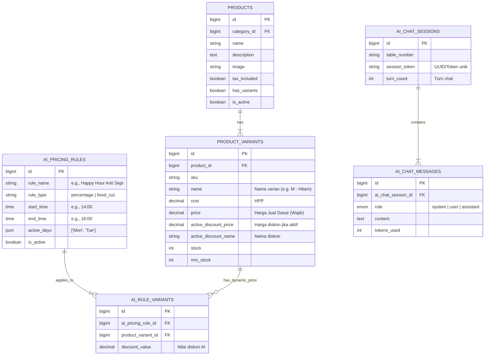

# ERD & Skema Database (Pondasi Data)

## Dokumen Kontrol
* **Nama Proyek:** Pakaiapp.online (EzMenu Platform)
* **Fitur Utama:** AI Autonomous Menu Engine (Sistem Menu Otomatis & Interaktif)
* **Versi:** 1.0
* **Status:** System Design Phase

---

## 1. Aturan Mutlak Arsitektur Data
1. **Zero Price on Products:** Tabel `products` sama sekali tidak boleh memiliki kolom harga.
2. **Absolute Variant Pricing:** Harga dasar (`base_price`) wajib tersimpan eksklusif di tabel `variants`.
3. **Non-Destructive Override:** AI tidak boleh menimpa (overwrite) `base_price` secara permanen saat mengeksekusi harga dinamis. AI hanya menyuntikkan harga promo melalui relasi rule yang aktif (Pivot Table).

---

## 2. Visualisasi ERD (Entity Relationship Diagram)

---

## 3. Spesifikasi Tabel & Logika Relasi

### A. Core Menu Engine (Tabel Eksisting - Penyesuaian)
1. **`products`**
   * *Fungsi:* Menyimpan identitas induk makanan/minuman/pakaian.
   * *Catatan:* Bebas dari kolom `price`.
2. **`product_variants`**
   * *Fungsi:* Menyimpan entitas riil yang dibeli, termasuk harga dasar, diskon aktif, dan stok.
   * *Kolom Kunci:* `price` (Decimal). Harga ini menjadi acuan utama sebelum dipotong oleh sistem AI. `active_discount_price` menampung diskon aktif jika ada.

### B. AI Auto-Pilot Pricing Module (Tabel Baru)
1. **`ai_pricing_rules`**
   * *Fungsi:* Menyimpan konfigurasi "Set & Forget" dari merchant (misal: Happy Hour).
   * *Cara Kerja:* Cron job Laravel akan mengecek tabel ini setiap menit. Jika waktu saat ini (H:i) cocok dengan `start_time` dan `active_days`, aturan ini dianggap *Live*.
2. **`ai_rule_variants` (Pivot Table)**
   * *Fungsi:* Menghubungkan aturan dinamis (Rule) dengan target spesifik varian produk.
   * *Cara Kerja untuk menghindari redundansi:* Saat pelanggan *checkout*, sistem POS Pakaiapp akan melakukan pengecekan:
     `Harga Akhir = Cek apakah variant ini terhubung dengan ai_pricing_rules yang aktif? Jika Ya, (price - discount_value). Jika Tidak, gunakan price.`

### C. AI Contextual Chat Module (Tabel Baru)
1. **`ai_chat_sessions`**
   * *Fungsi:* Membatasi konteks percakapan di satu meja agar AI tidak berhalusinasi dan menghemat token.
   * *Kolom Kunci:* `turn_count` (Integer). Setiap ada pesan masuk/keluar, nilai ini bertambah. Jika mencapai batas maksimal (misal: 7), sesi ditutup.
2. **`ai_chat_messages`**
   * *Fungsi:* Menyimpan histori pesan sebagai *array context* yang akan dikirim kembali ke API OpenAI (menggunakan `role`: user/assistant).
   * *Kolom Kunci:* `tokens_used`. Digunakan untuk men-generate laporan "Biaya AI" di dashboard admin.