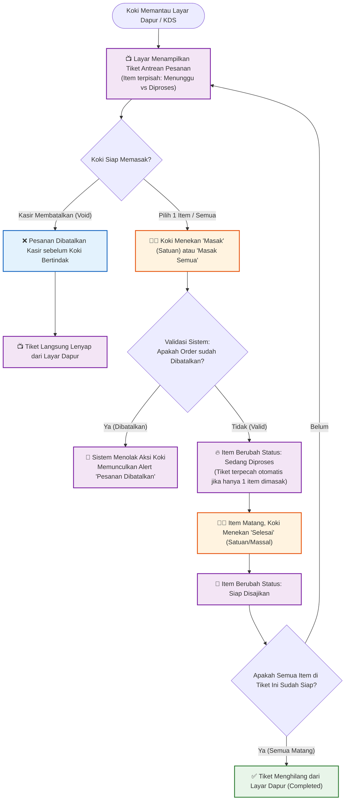
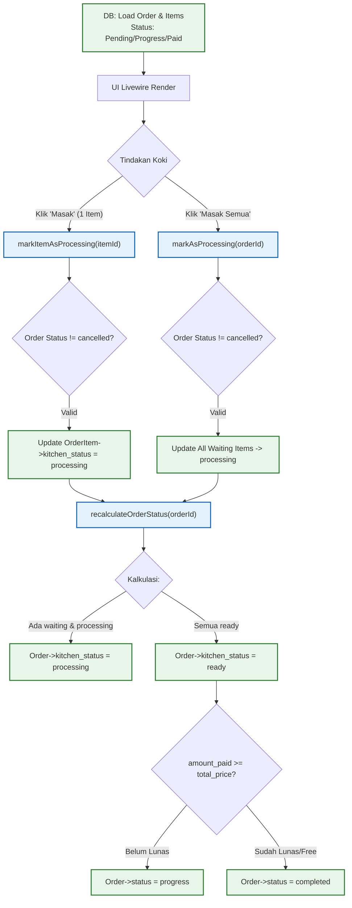

# Alur Bisnis (Business Logic) - Dapur (Kitchen)

Berikut adalah *flowchart* murni dari sisi **alur bisnis operasional dapur** yang telah diperbarui dengan kapabilitas pemrosesan per-item dan validasi anti-fraud.

## 1. Flowchart Operasional Dapur

## Analisa Logika Bisnis Dapur Terkini
1. **Pemrosesan Fleksibel (Satuan vs Massal)**: Koki sekarang memiliki otonomi penuh. Jika ada 5 menu dalam 1 nota, koki bisa memasak 1 menu dulu, dan tiket di layar akan otomatis memecah diri (1 sedang diproses, 4 menunggu). Tombol aksi massal ("Mulai Masak Semua") juga tetap tersedia untuk kecepatan.
2. **Keamanan Anti-Fraud & Race-Condition**: Ada *shield* pertahanan baru. Jika Kasir secara kebetulan menekan tombol Batal tepat beberapa detik sebelum Koki menekan tombol Masak, sistem KDS akan langsung menolak input Koki. Ini mencegah sinkronisasi status hantu (*ghost orders*).
3. **Live Refresh Tanpa Gangguan**: Koki dilengkapi dengan tombol Refresh Livewire yang memperbarui daftar pesanan masuk tanpa membuat browser berkedip (*full reload*).

---

## 2. Alur Teknis (Code Logic) - Modul Dapur Terkini

