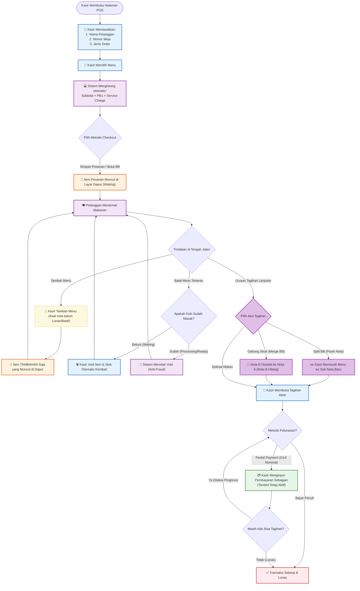
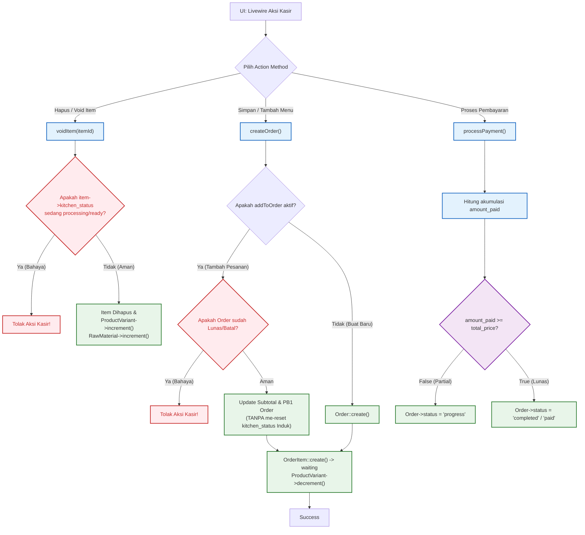

# Analisa Alur Sistem Kasir Resto Terkini

Dokumen ini berisi pemetaan lengkap sistem kasir restoran setelah perombakan skalabilitas dan keamanan tingkat *Enterprise*.

---

## 1. Alur Bisnis (Business Logic) Terkini
*Sudut pandang kasir dan operasional di lapangan.*

---

## 2. Alur Teknis (Code & Database Logic) Terkini

## Solusi Inovatif yang Telah Diterapkan
1. **Keamanan Lintas Tab (Anti-Fraud Resto)**
   - Kasir tidak bisa mem-void item yang diam-diam sudah dimasak koki.
   - Kasir tidak bisa menambah pesanan ke meja yang ternyata sudah dibayar lunas melalui ponsel (*Digital Payment*) atau oleh kasir rekanannya.
2. **Fleksibilitas Pelunasan (Partial & Split/Merge)**
   - Mendukung pembayaran sebagian (*Partial Payment*). Tombol bayar tidak lagi diblokir jika uang pelanggan kurang, sistem otomatis mencatatnya sebagai cicilan (status `progress`).
   - Fitur Gunting (*Split Bill*) dan Fitur Panah (*Merge Bill*) saling melengkapi untuk mengizinkan kasir "Bongkar-Pasang" isi nota kapanpun dibutuhkan sebelum pelunasan akhir.
3. **Pengembalian Stok Akurat (Smart Restock)**
   - Fitur pembatalan (*Void/Cancel*) kini mendeteksi tipe toko. Pada Kasir Resto, sistem akan menelusuri resi resep (`recipes`) dan mengembalikan persis bahan mentah (`RawMaterial`) ke dalam gudang, membebaskan manajer inventaris dari audit manual.
