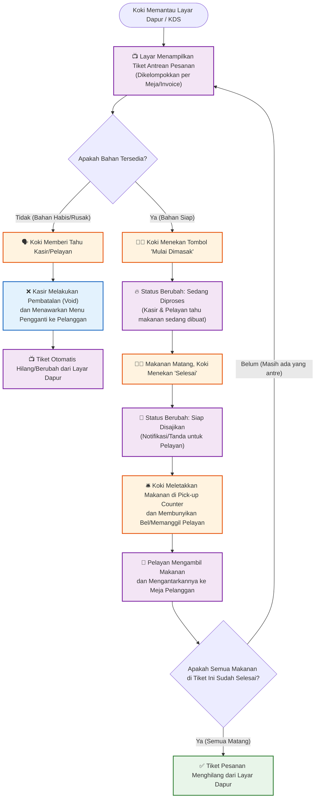
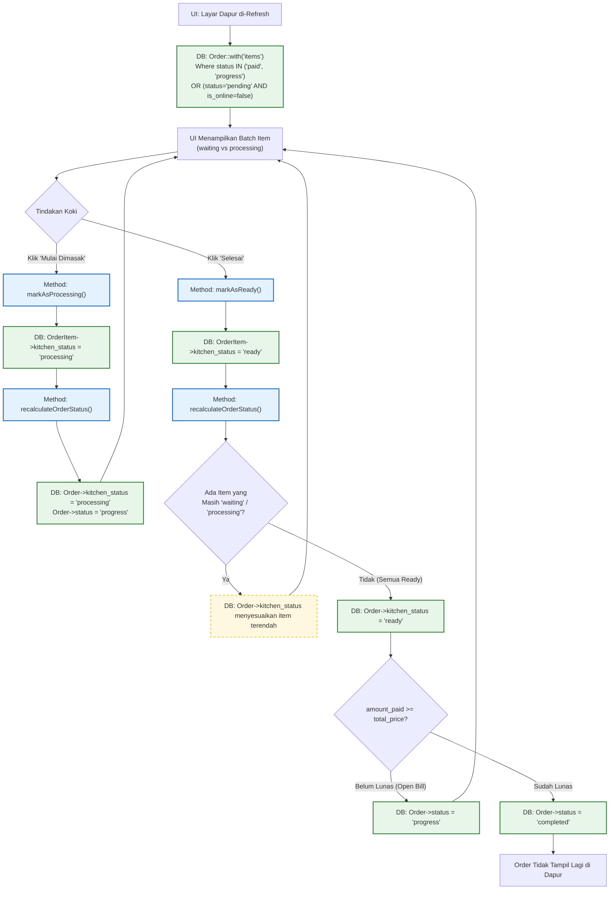

# Alur Bisnis (Business Logic) - Dapur (Kitchen)

Berikut adalah *flowchart* murni dari sisi **alur bisnis operasional dapur**, yang menggambarkan bagaimana Koki (Chef) dan Pelayan (Waiter) berinteraksi dengan pesanan yang masuk.

## 1. Flowchart Operasional Dapur

## Analisa Logika Bisnis Dapur
1. **Pengelompokan (Batching)**: Dapur yang sibuk tidak memasak per *invoice*, melainkan per *item* atau *batch*. Layar Dapur (*Kitchen Display System*) harus mampu memisahkan makanan yang baru masuk ("Menunggu") dengan makanan yang sudah masuk wajan ("Sedang Diproses").
2. **Komunikasi Dua Arah**: Koki butuh fitur "Tolak/Bahan Habis". Jika di tengah proses memasak kokinya sadar bahan bakunya rusak, harus ada mekanisme koki menekan tombol "Habis" agar kasir langsung mendapat notifikasi untuk membatalkan item tersebut (Void). 
3. **Pemisahan Dapur (Station)**: Jika restoran cukup besar, pesanan minuman harusnya masuk ke layar Barista, sedangkan makanan masuk ke Koki. Saat ini sistem Anda menggabungkan semuanya dalam satu layar `kitchen`.

---

## 2. Alur Teknis (Code Logic) - Modul Dapur
*Bagaimana kode `kitchen.php` merespons tindakan dari Koki di atas.*

## Temuan / Bug Teknis pada Logika Kode Dapur
1. **Tidak Ada Fitur Tolak/Kosong (*Out of Stock*)**: Koki tidak memiliki fungsi (*method*) di dalam `kitchen.php` untuk menolak pesanan jika bahan habis.
2. **Bug `markAsProcessing` Menarik Semua Item Sekaligus**: Berdasarkan fungsi `$order->items()->where('kitchen_status', 'waiting')->update(...)`, jika ada 5 item 'waiting' dalam satu invoice, mengklik "Mulai Dimasak" akan **mengubah ke-5 item tersebut menjadi 'processing' secara massal**. Koki tidak bisa memilih untuk memasak 1 per 1 itemnya.
3. **Bug Multi-Kasir (Is Online)**: Kode memfilter antrean dapur dengan klausa `where('status', 'pending')->where('is_online', false)`. Ini baik karena menahan order *online* yang belum dibayar. Namun, jika pelayan (*waiter*) menggunakan perangkat *mobile* dan aplikasi menganggapnya sebagai *online*, ordernya tidak akan masuk ke dapur sampai pelanggan bayar!
