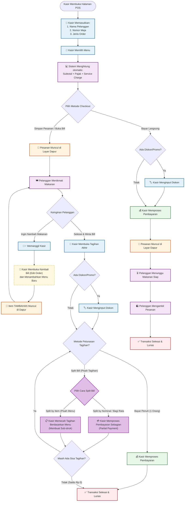
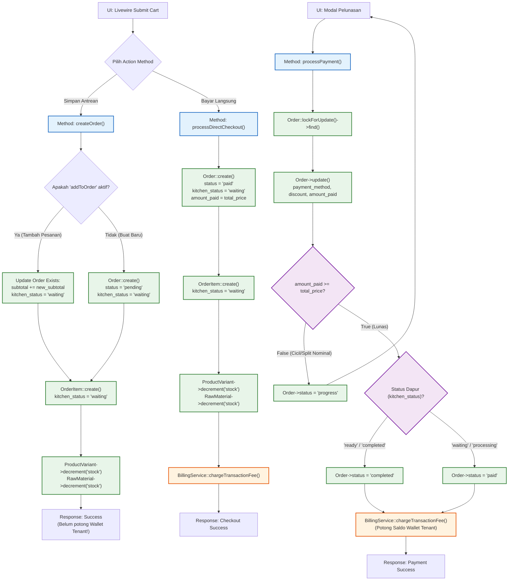

# Analisa Alur Sistem Kasir Resto

Dokumen ini berisi pemetaan lengkap sistem kasir restoran Anda, terbagi menjadi dua bagian: **Alur Bisnis (Operasional)** dan **Alur Teknis (Code & Database)**.

---

## 1. Alur Bisnis (Business Logic)
*Sudut pandang kasir dan operasional di lapangan.*

---

## 2. Alur Teknis (Code & Database Logic)
*Bagaimana kode Laravel (`resto-cashier.php`), Livewire, dan Database memproses alur bisnis di atas.*

## Analisa Logika Kode Saat Ini (Code Flaws & Bugs)

Pemetaan kode di atas mengungkapkan beberapa kelemahan pada implementasi teknis saat ini:

### 🔴 1. Bug Dapur Ter-Reset (Double Cook Bug)
- **Titik Lemah**: Di `createOrder()` (jalur *Tambah Pesanan*), saat kasir mengedit pesanan yang sudah ada, *parent* tabel `Order` langsung dipaksa diperbarui menjadi `kitchen_status = 'waiting'` (terlihat di kotak `M1_A`). 
- **Dampak**: Jika pesanan pelanggan gelombang pertama sedang digoreng (`processing`) oleh koki, namun pelanggan menambah pesanan es teh manis, koki akan kebingungan karena di layar rekap pesanan utama statusnya kembali menjadi *waiting*.
- **Solusi**: Biarkan `kitchen_status` pada tabel `Order` tetap pada status *progress* tertingginya, dan biarkan modul Dapur mengacu murni pada `kitchen_status` yang ada di tabel *child* (`OrderItem`).

### 🟡 2. Void Menu & Pengembalian Stok (Restock) Tidak Ada
- **Titik Lemah**: Terlihat pada kotak eksekusi `ProductVariant->decrement('stock')` di kedua metode. Pemotongan stok **langsung terjadi seketika** di sisi *database*.
- **Dampak**: Secara kode, sistem Anda murni melakukan pengurangan (*decrement*). Tidak ada *method* atau *endpoint* untuk `increment('stock')`. Jika pesanan pelanggan dibatalkan atau diretur, stok barang dan bahan baku mentah dapur yang sudah terpotong tidak akan pernah bisa kembali, mengacaukan *inventory* restoran.

### 🟡 3. Split by Nominal Berjalan Tanpa Disadari
- **Titik Lemah**: Pada kotak pengecekan `amount_paid >= total_price?`, sistem menetapkan status `'progress'` jika pembayaran kurang dari total.
- **Dampak Positif**: *Backend* Anda secara teknis **sudah mendukung pembayaran parsial/cicilan (Split by Nominal)** secara tidak sengaja.
- **Kekurangan**: UI di Livewire kasir Anda belum mendukung hal ini secara sadar. UI hanya mengirimkan nominal penuh (seringkali melempar sisa sebagai kembalian). Perlu ada modifikasi UI untuk mengizinkan kasir menginput "Bayar Sebagian".
